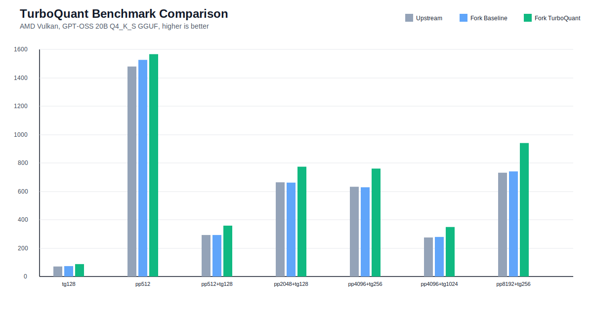
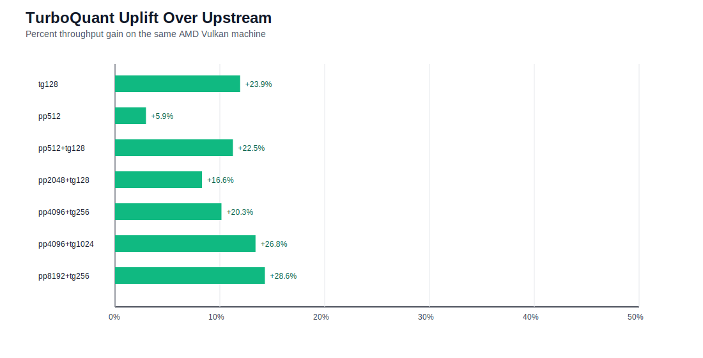

# TurboQuant Benchmark Report

This document records the current AMD Vulkan benchmark state for the TurboQuant fork against:

- the same fork running standard KV cache mode
- a clean upstream `llama.cpp` build at the same commit

## Test Environment

- Host: `AMD RYZEN AI MAX+ 395 w/ Radeon 8060S`
- GPU backend: Vulkan
- Vulkan device: `AMD Radeon(TM) 8060S Graphics`
- Model: `C:\Users\jimli\.lmstudio\models\unsloth\gpt-oss-20b-GGUF\gpt-oss-20b-Q4_K_S.gguf`
- Cache types: `-ctk f16 -ctv f16`
- Flash attention: enabled
- GPU layers: `999`
- Split mode: `none`

Fork build under test:

- binary: `build-vulkan-tests/bin/Release/llama-bench.exe`

Upstream comparison build:

- worktree: `upstream-clean/`
- binary: `upstream-clean/build-vulkan/bin/Release/llama-bench.exe`

Both builds were run at commit `389c7d495`.

## Methodology

Fork baseline vs TurboQuant used the harness in `scripts/bench-turboquant-vulkan.ps1`.

Command shape:

```powershell
powershell -ExecutionPolicy Bypass -File .\scripts\bench-turboquant-vulkan.ps1 `
  -Model "C:\Users\jimli\.lmstudio\models\unsloth\gpt-oss-20b-GGUF\gpt-oss-20b-Q4_K_S.gguf" `
  -Device "Vulkan0" `
  -Repetitions 3 `
  -PromptGenList "0,128;512,0;512,128;2048,128;4096,256;4096,1024;8192,256"
```

The harness runs:

- baseline: standard KV path
- TurboQuant: `--kv-codec turboquant --kv-tq-runtime vulkan`

Upstream was run with the matching `llama-bench` settings and the same `-pg` set.

## Current Results

Large repeated comparison:





TurboQuant uplift over upstream:

| test | upstream t/s | fork turboquant t/s | uplift |
| --- | ---: | ---: | ---: |
| `tg128` | 70.55 | 87.42 | `+23.9%` |
| `pp512` | 1479.21 | 1566.64 | `+5.9%` |
| `pp512+tg128` | 292.44 | 358.20 | `+22.5%` |
| `pp2048+tg128` | 663.57 | 773.61 | `+16.6%` |
| `pp4096+tg256` | 632.22 | 760.25 | `+20.3%` |
| `pp4096+tg1024` | 274.96 | 348.72 | `+26.8%` |
| `pp8192+tg256` | 731.41 | 940.26 | `+28.6%` |

| test | upstream t/s | fork baseline t/s | fork turboquant t/s |
| --- | ---: | ---: | ---: |
| `tg128` | 70.55 | 73.35 | 87.42 |
| `pp512` | 1479.21 | 1526.90 | 1566.64 |
| `pp512+tg128` | 292.44 | 292.43 | 358.20 |
| `pp2048+tg128` | 663.57 | 661.38 | 773.61 |
| `pp4096+tg256` | 632.22 | 628.56 | 760.25 |
| `pp4096+tg1024` | 274.96 | 278.76 | 348.72 |
| `pp8192+tg256` | 731.41 | 740.46 | 940.26 |

Artifacts:

- fork paired run: `bench-results/turboquant-vulkan-20260330-193847/`
- upstream run: `bench-results/upstream-vulkan-20260330-1944/`
- comparison summary: `bench-results/upstream-vs-turboquant-20260330-large.md`

## Interpretation

At this point the result is not just "TurboQuant works." On this AMD Vulkan setup, the current TurboQuant path is materially faster than:

- upstream `llama.cpp`
- the fork's standard KV mode

That is important because earlier benchmark passes were misleading: the compressed attention path had been implemented, but it was not actually being exercised in the real flash-attention workload. The key enabling fix was making sure the backend resident compressed shadow was seeded and addressable by the same tensor/view identity that Vulkan flash attention uses.

## Caveats

- These numbers are for one machine, one Vulkan driver stack, and one model family.
- The strongest results here are on mixed prompt+generation and generation-heavy workloads.
- HIP has compile-validated backend support, but the benchmark proof in this repository is currently Vulkan-backed.
- The current result is good enough to justify further investment, but it is still a forked implementation rather than a polished upstream-ready patch series.

## What These Benchmarks Do Not Prove

These results should not be read as "TurboQuant fixes every long-context problem."

In particular, they do not prove that TurboQuant solves very large prompt-ingest or prefill bottlenecks on local hardware.

That distinction matters:

- TurboQuant directly targets KV-cache efficiency.
- KV-cache efficiency often helps most in generation-heavy and mixed workloads.
- Very large prompt evaluation can still be dominated by prefill compute, which TurboQuant does not magically remove.

In other words:

- if the main problem is decode or mixed prompt+generation throughput, TurboQuant can help a lot
- if the main problem is extreme long-context prompt loading, TurboQuant may help memory fit but still leave prefill speed as the usability wall

This is why future benchmark work should include context-growth curves in addition to fixed `pp` / `tg` points.

## Recommended Next Benchmark Work

- Add a second model family so the result is not anchored to one GGUF.
- Increase repetitions for the heaviest shapes if presentation variance matters.
- Run a memory-footprint comparison alongside throughput.
- Add a HIP benchmark pass once ROCm runtime validation is in place on target hardware.

## How The Result Could Improve Further

The current benchmark lead is already strong, but there are still obvious places to push it further:

- reduce or remove remaining compatibility-path overhead in the Vulkan backend
- broaden direct compressed attention coverage beyond the currently validated path mix
- validate and tune the HIP path on real ROCm hardware
- add memory-footprint reporting so the tradeoff is visible in both speed and capacity terms
- test more model families to find where TurboQuant gains are strongest and where they flatten out
- add prompt-ingest scaling plots so we can show clearly where TurboQuant helps and where prefill remains the real bottleneck
